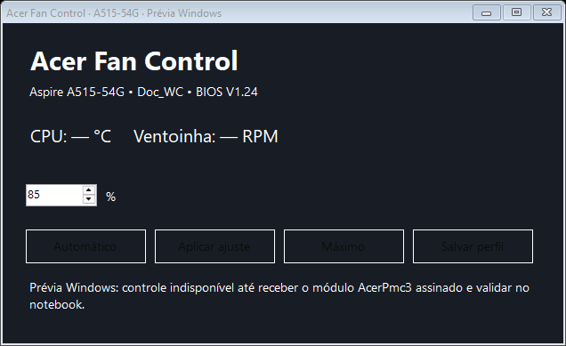
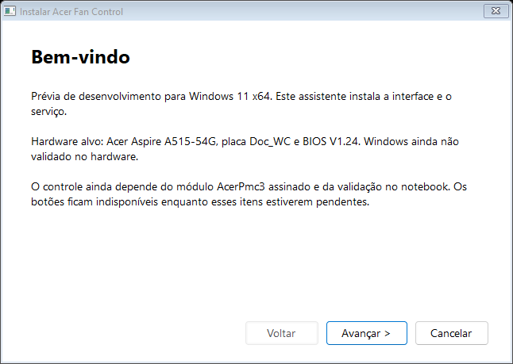

# Acer Fan Control — prévia para Windows 11 x64

**Esta versão ainda não controla as ventoinhas em uma instalação comum do Windows.** O aplicativo, serviço, protocolo PMC3 e instalador foram adaptados, mas o módulo `AcerPmc3` precisa de assinatura aceita pela edição oficial do PawnIO e o conjunto precisa de validação física no Acer. Não distribua como versão funcional ou validada. Nenhum driver vulnerável é incluído e o instalador não desativa proteções do Windows.

Hardware alvo: Aspire A515-54G, placa Doc_WC, BIOS V1.24, ITE IT8987. Essas identificações e as portas/PWM do controlador são verificadas antes de aceitar comandos. Os testes no Fedora do projeto original não comprovam a versão Windows.

## Instalar a prévia

Extraia `Acer-Fan-Control-Windows11-x64-Preview.zip` e abra `Instalar.exe`. Autorize o administrador, clique em **Avançar**, escolha as opções, clique em **Instalar** e **Concluir**. A instalação adiciona o serviço `AcerFanControl` e, se selecionado, uma tarefa que abre a interface minimizada no login do administrador que instalou. Não exige Python ou compiladores no computador de destino.

O serviço inicia com o Windows e mantém o perfil salvo com a interface fechada. Instalação em `%ProgramFiles%\AcerFanControl`; perfil protegido em `%ProgramData%\AcerFanControl`. A interface precisa de administrador. A desinstalação está em Configurações > Aplicativos. Prefere-se o modelo validado e não há suporte anunciado a outros Acer.

## Controle e limites

Automático devolve o controle ao firmware e limpa o perfil manual. Manual aceita PWM 183–255 (aproximadamente 72–100%); Máximo solicita 255. CPU a partir de 85 °C força máximo. Falha de sensor tenta restaurar o duty original e interrompe o controle. Um comando temporário volta ao último perfil salvo após desconexão ou perda do heartbeat; Salvar perfil mantém o modo no serviço. A rotina automática do firmware nunca é desabilitada.

A comunicação local aceita apenas ações limitadas, acessíveis a administradores; clientes de rede são negados. A interface não oferece escrita arbitrária no EC.

## Dependência pendente

`driver/AcerPmc3.p` implementa operações limitadas sobre PMC3 e leituras I2EC. Foi compilado com Pawn 4.1.7152 e cabeçalhos PawnIO. O arquivo `.amx` gerado não é um módulo assinado e não é instalado como `AcerPmc3.bin`. A edição oficial do PawnIO exige assinatura do módulo. O módulo oficial `LpcIO` não permite as portas PMC3 0x6A/0x6E. Não instale a edição irrestrita e não desative Integridade de memória, Secure Boot ou assinatura de drivers para usar esta prévia.

Antes de uma versão funcional: obter revisão/assinatura do módulo; testar no A515-54G a identificação, leituras, Automático/Manual/Máximo, restauração ao parar/crash, concorrência com ACPI, suspensão/retomada e persistência após reiniciar. A comunicação com firmware Windows e seus drivers pode diferir do Fedora.

## Compilar e testar

Execute `build.ps1` em Windows x64 com .NET Framework 4.x. Compila interface, serviço e instalador; roda testes simulados sem tocar no hardware. `Tests.cs` verifica identificação, limites PWM, proteção térmica, perfil salvo, perda de heartbeat e restauração. O instalador inclui o aplicativo e os documentos, sem perfil, logs ou dados da máquina de desenvolvimento.

Licença do código adaptado: MIT, veja LICENSE. PawnIO é uma dependência externa: [documentação oficial](https://github.com/namazso/PawnIO.Modules/wiki/Using-PawnIO-Modules), [distribuição](https://pawnio.eu/). Os cabeçalhos de compilação PawnIO têm licença 0BSD; o compilador Pawn é Apache-2.0. Esses componentes de compilação não são redistribuídos no instalador.

